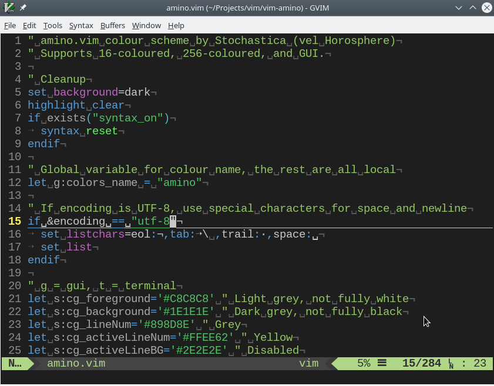

# vim-amino

Amino color theme for Vim and Vim-airline.



## Usage

After cloning `amino.vim` to `~/.vim/colors/amino.vim`, append the following to
the end of `$MYVIMRC`:
```vim
colorscheme amino
```

## Issues

At the moment Amino checks the loading status of airline by
```vim
if exists('g:airline_powerline_fonts')
```
Hence the symbol `g:airline_powerline_fonts` must be defined before loading
Amino.
